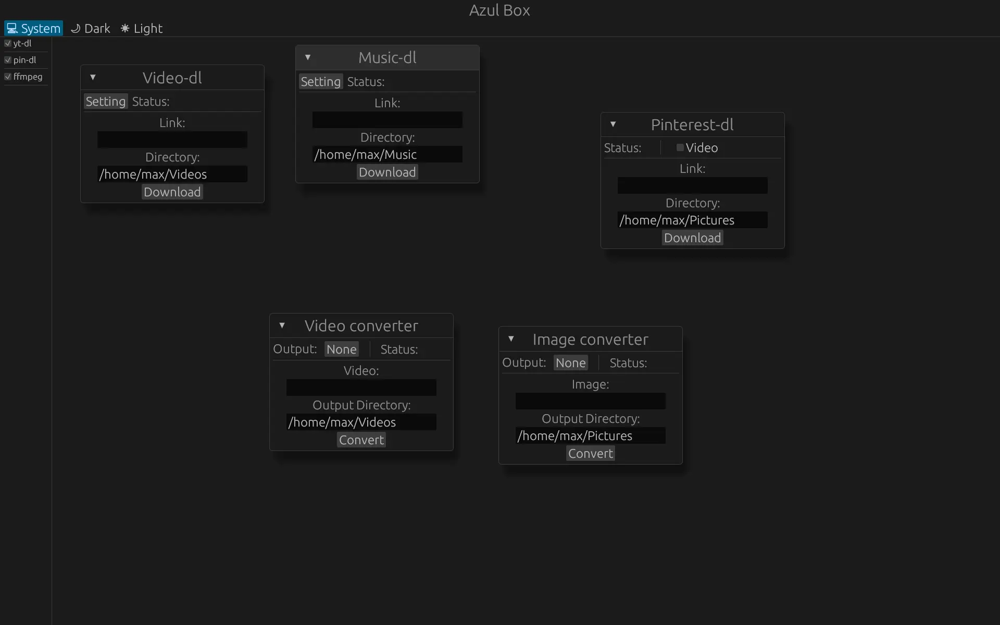

# Azul Box

</img>

<noscript><a href="https://liberapay.com/Tahoso/donate"></a></noscript>

## Status

**The Github repo is just a mirror for my [codeberg](https://codeberg.org/Tahoso/azul-box)**

**If you want to install binary please check out on my [codeberg](https://codeberg.org/Tahoso/azul-box)**

This project is in a maintenance mode-ish state. I'll fix any app-breaking bugs that appear from time to time. PRs are still welcome for features, bug fixes, etc. I may still add features when I feel like it. The reason for this status is that the software is completely functional for my use case, and the code is kinda sucky which make me feel lazy.

## Feature

- Download music from link with metadata/cover embedded with synced lyric(lyric do not work for WAV)
- Download Video from link with highest quality with some metadata embeded
- Download Pin from pinterest without account
- Convert Images formats powered by ffmpeg
- Convert Video formats powered by ffmpeg

The video/music download will technically support all yt-dlp [support list](https://github.com/yt-dlp/yt-dlp/blob/master/supportedsites.md) not just youtube.

The features will be really random because this is a software I made to randomly do something I needed.

## Dependencies

- cargo
- ffmpeg
- python

### Archlinux:

```
sudo pacman -S cargo ffmpeg python
```

### Linuxmint(Ubtuntu based):

```
sudo apt install cargo libasound2-dev ffmpeg python3.12
```

### openSUSE Tumbleweed:

You may need to add some extra official opensuse repo.

```
sudo zypper in cargo alsa-devel python315
```

### Fedora(non atomic):

```
sudo dnf install cargo alsa-lib-devel ffmpeg-free python3.11
```

## Installation

Build from source(make sure you have installed all dependencies first):

```
git clone https://codeberg.org/Tahoso/azul-box
cd azul-box
sudo chmod +x install.sh
./install.sh
```

Or download the binary on [codeberg](https://codeberg.org/Tahoso/azul-box)

## Uninstallation

if you used the `install.sh` script:

```
sudo rm /usr/bin/azulbox
sudo rm /usr/share/icons/hicolor/scalable/apps/page.codeberg.tahoso.azul_box.svg
sudo rm /usr/share/applications/page.codeberg.tahoso.azul_box.desktop
```

or just uninstall via your package manager if you install via apt

## Showcase

<div align="center">
</img>
</img>
</div>

[Demo](https://github.com/user-attachments/assets/07a4689a-24ee-4fa1-ae87-0c99072d7fdd)
