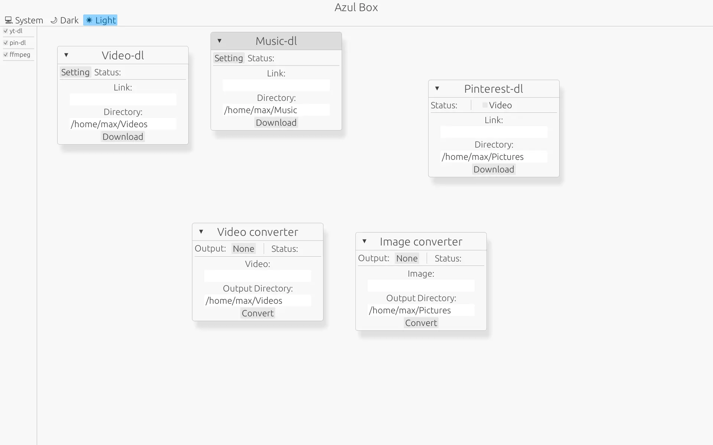

# Azul Box

</img>

<a href='https://flathub.org/apps/page.codeberg.tahoso.azul-box'>
  
</a>

<a href="https://liberapay.com/Tahoso/donate"></a>

## Status

**The Github repo is just a mirror for my [codeberg](https://codeberg.org/Tahoso/azul-box)**

**If you want to install binary please check out on my [codeberg](https://codeberg.org/Tahoso/azul-box/releases)**

The Windows version is **highly** experimental. I do not have time to test it on Windows. If you are interested in fixing or maintaining the Windows version, pr are welcome.


## Feature

- Download music from link with metadata/cover embedded with synced lyric(lyric do not work for WAV)
- Download Video from link with highest quality with some metadata embeded
- Download Pin from pinterest without account
- Convert Images formats powered by ffmpeg
- Convert Video formats powered by ffmpeg

The video/music download will technically support all yt-dlp [support list](https://github.com/yt-dlp/yt-dlp/blob/master/supportedsites.md) not just youtube.

The features will be really random because this is a software I made to randomly do something I needed.

## Dependencies

- cargo
- ffmpeg
- python

## Installation

flatpak(strongly recommended):

```
flatpak install flathub page.codeberg.tahoso.azul-box
```

Build from source(make sure you have installed all dependencies first):

```
git clone https://codeberg.org/Tahoso/azul-box
cd azul-box
sudo chmod +x install.sh
./install.sh
```

Or download the binary on [codeberg](https://codeberg.org/Tahoso/azul-box/releases)(make sure you have installed all dependencies first)

## Uninstallation

if you used the `install.sh` script:

```
sudo rm /usr/bin/azulbox
sudo rm /usr/share/icons/hicolor/scalable/apps/page.codeberg.tahoso.azul-box.svg
sudo rm /usr/share/applications/page.codeberg.tahoso.azul-box.desktop
```

or just uninstall via your package manager if you install via apt

## Showcase

<div align="center">
</img>
</img>
</div>

[Demo](https://github.com/user-attachments/assets/07a4689a-24ee-4fa1-ae87-0c99072d7fdd)
